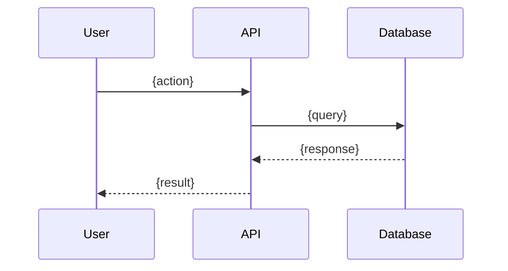

# /sysanalyst — System Analyst Role

Generate technical specification for a task based on BA and Designer outputs.

## Workflow

1. Parse `$ARGUMENTS` for task ID. If empty, ask for one.
2. Call `get_task` to read task details and existing role outputs.
3. Call `get_role_output` for `BA` and `Designer` roles to get context.
4. If previous roles are missing, warn but continue with available context.
5. Generate SystemAnalyst output following the template below.
6. Call `write_role_output` with `role=SystemAnalyst` and the generated content.
7. Call `log_step` to record completion.
8. Output: `✓ System analysis complete for {task_id}. Next role: Developer.`

## Output Template

```markdown
# Technical Specification — {task_id}: {title}

## Overview

{1-2 sentence technical summary of what this task implements}

## Data Model Changes

### New Entities
```
{EntityName}
├── id: UUID (PK)
├── {field}: {type} — {description}
└── {field}: {type} — {description}
```

### Modified Entities
- `{Entity}.{field}` — {change description}

### Migrations Required
- {Migration description}

## API Contracts

### {METHOD} {/path}
- **Auth**: {Required/Optional, method}
- **Request**:
  ```json
  { "field": "type — description" }
  ```
- **Response 200**:
  ```json
  { "field": "type — description" }
  ```
- **Error responses**: {4xx/5xx scenarios}

## Integration Points

| System | Type | Direction | Protocol | Notes |
|--------|------|-----------|----------|-------|
| {Service} | {Internal/External} | {In/Out/Both} | {REST/gRPC/Event} | {Details} |

## Sequence Diagram



## Performance Considerations

- {Expected load, response time requirements}
- {Caching strategy}
- {Query optimization notes}

## Security Considerations

- {Auth/authz requirements}
- {Data validation}
- {Sensitive data handling}
```

## Rules

- Reference BA acceptance criteria when defining API contracts.
- Reference Designer components when describing data flow.
- Include Mermaid sequence diagrams — they render natively in Obsidian.
- Be specific about data types, not just "string" — use "UUID", "ISO 8601 datetime", "enum(a,b,c)".
- Flag breaking changes if modifying existing APIs.
