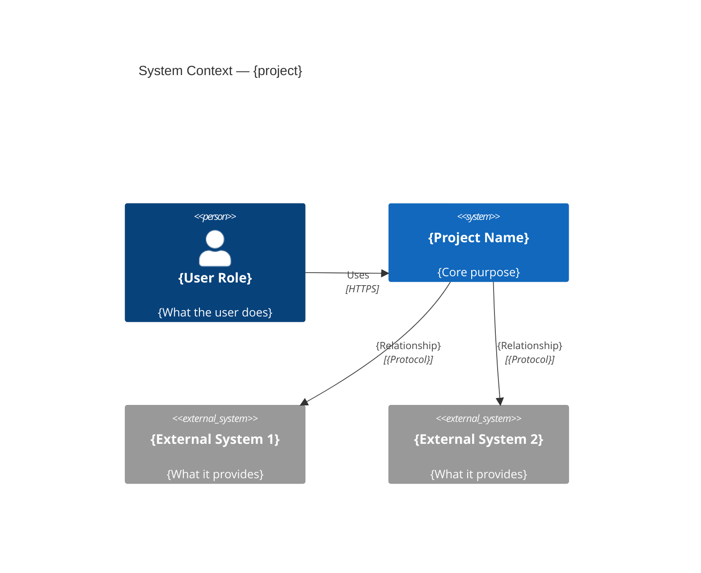
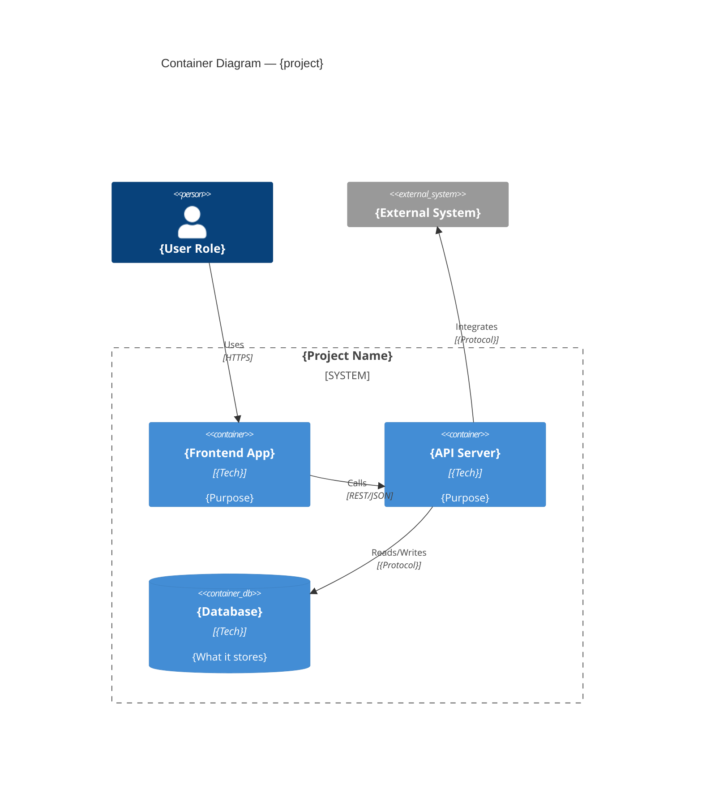
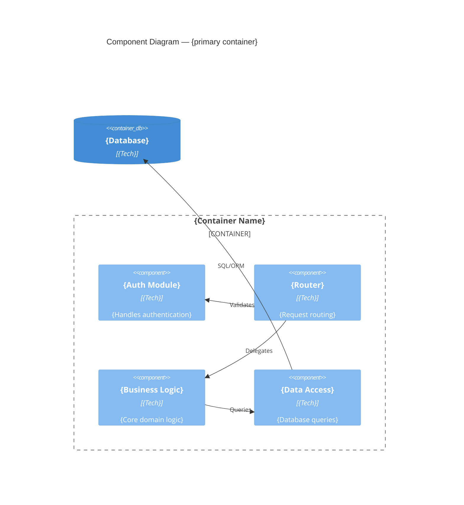
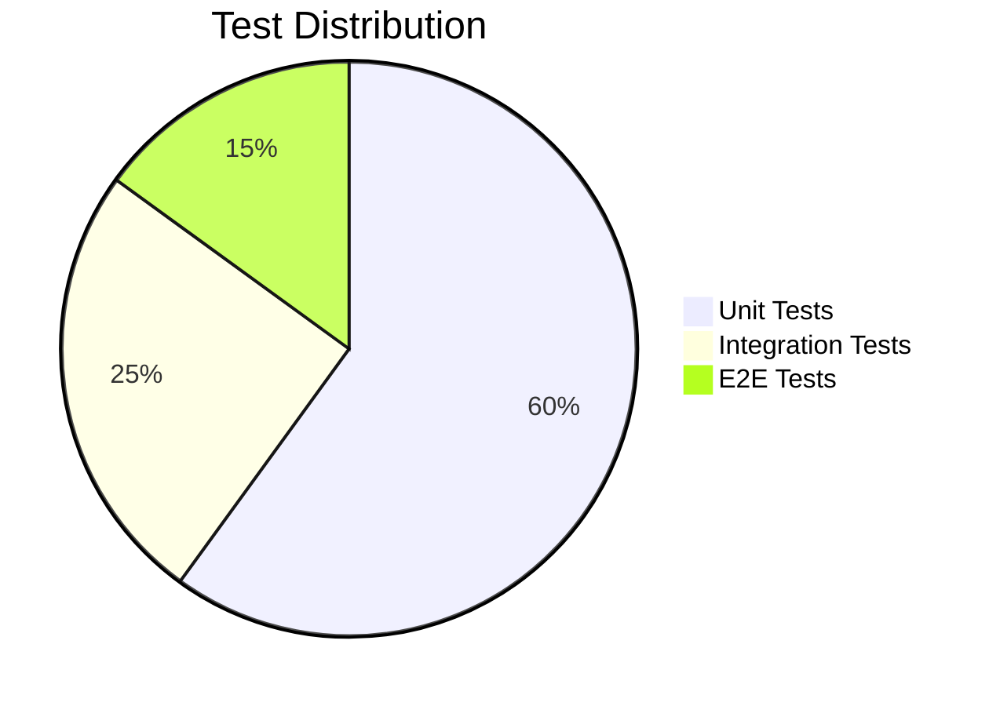
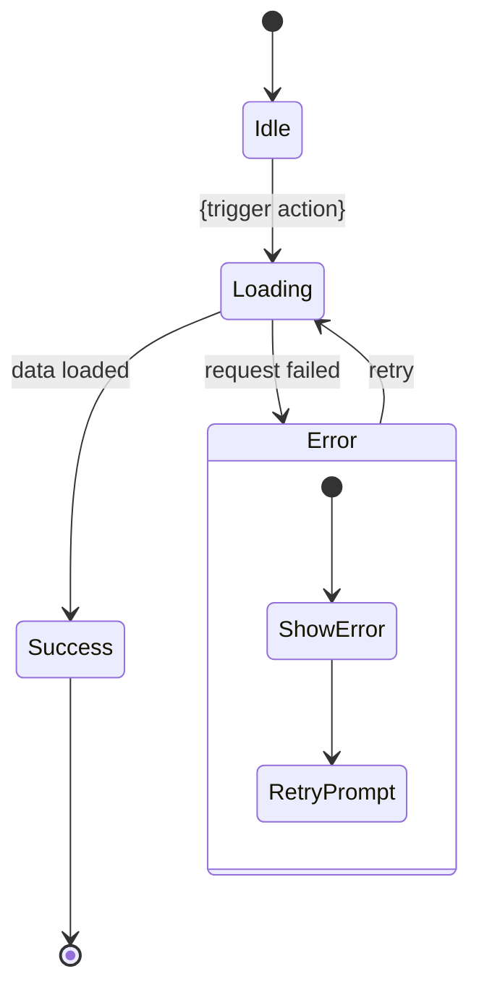
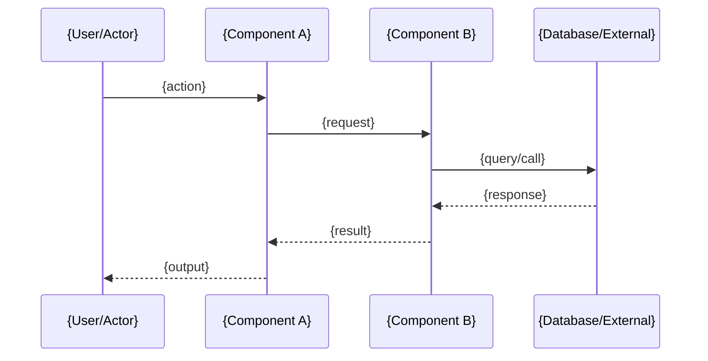
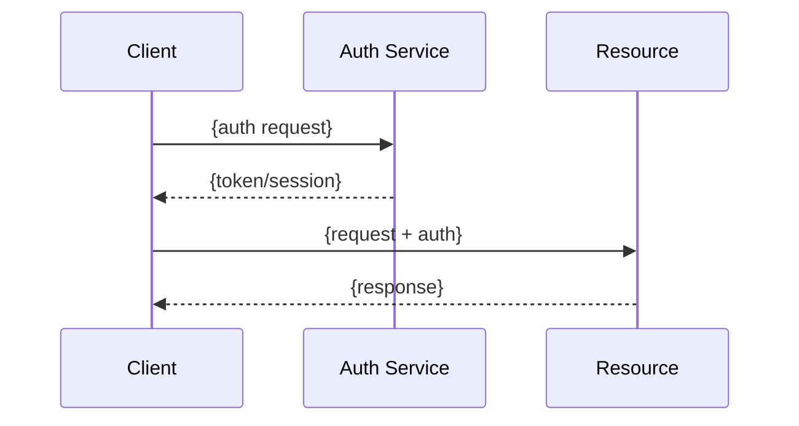
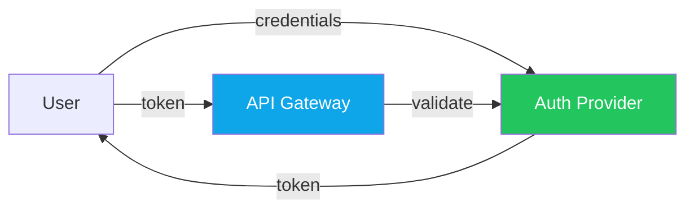

# /vault:docs — Documentation Generator

Scan the project and generate **professional-grade** documentation for empty Obsidian vault sections — and **standardize + actualize existing docs** that don't meet the VaultOps format — with C4 architecture diagrams, cross-linked MOCs, and rich Mermaid visualizations.

---

## Critical Path Rule

**NEVER construct vault paths manually.** All file paths MUST come from `section_paths` returned by `generate_docs_prompt`. Valid vault paths always start with `~/.vaultops/vault/` (expanded). If you find yourself writing to any other location (e.g. `~/Projects/obsidian/`), STOP — you are using the wrong path. Re-call `generate_docs_prompt` and use its `section_paths`.

**NEVER use `mcp__obsidian__*` tools** (write_note, read_note, patch_note, etc.) for docs generation. The user may have a separate Obsidian MCP installed that points to a different vault. Always use the `Write` / `Read` tools with absolute paths from `section_paths`. This is the only way to guarantee files land in the correct VaultOps vault.

---

## Steps

### Phase 1 — Classify (sequential, fast)

1. Call `generate_docs_prompt` with the current `project_path`.
   - Extract `vault_project`, `section_paths`, `sections`, and `renames` from the response.
   - **VERIFY:** Confirm every path in `section_paths` contains `/.vaultops/vault/`. If not, stop and report the error.
   - If the response contains an error (e.g. project not registered), stop and tell the user to run `vaultops add` first.
   - **NOTE:** `generate_docs_prompt` automatically normalizes alias directories before returning.
     If the user had `01-Product/`, it is now renamed to `01-Requirements/` and all wiki-links
     are updated. The `renames` field lists what was renamed. All `section_paths` point to
     canonical directory names. If renames occurred, inform the user briefly.

2. **Classify each section into one of three buckets:**
   - `GENERATE` — status is `MISSING` or `EMPTY`
   - `EVALUATE` — status starts with `HAS_CONTENT` → needs compliance check (step 3)
   - `SKIP` — determined after compliance check in step 3

3. **Compliance check for each `EVALUATE` section.**
   Use the `Read` tool to read the primary doc file for that section (see Primary File Mapping below).
   The file path is: `section_paths[section] + "/" + primary_file_name`.
   If the primary file does not exist in the directory but other files do, reclassify as `STANDARDIZE`.
   If the primary file does not exist and no other files exist, reclassify as `GENERATE`.
   Otherwise check for all 3 compliance signals in the file content:
   - ✅ File starts with `---` (YAML frontmatter block)
   - ✅ At least one emoji heading (e.g. `# 🏗️`, `## 🛠️`, `## ⚡`)
   - ✅ At least one ` ```mermaid` block

   If **2 or more signals are absent** → reclassify as `STANDARDIZE`.
   If all 3 signals are present → reclassify as `SKIP`.

   **Primary File Mapping:**
   | Section | Primary file to read |
   |---------|---------------------|
   | `00-Overview` | `System Architecture.md` |
   | `01-Requirements` | `Product Goals.md` |
   | `02-Architecture` | `Architecture Deep Dive.md` |
   | `03-Design` | `User Flows.md` |
   | `04-Development` | `Codebase Map.md` |
   | `05-QA` | `Test Strategy.md` |
   | `06-Operations` | `Runbook.md` |
   | `07-References` | Check `Architecture Decisions.md`, `Glossary.md`, and `API Reference.md` **each independently** |
   | `09-Interfaces` | `API Contracts.md` |
   | `10-Security` | `Security Architecture.md` |
   | `11-Marketing` | `Go-To-Market.md` |

4. Read key project files to gather context: `README.md`, `package.json`, main entry points, `CLAUDE.md`.
   Keep this context in memory — all sub-agents in the next phases will receive it.

---

### Phase 2 — Generate 00-Overview first (sequential, foundational)

5. **Generate, merge, or standardize `00-Overview/System Architecture.md` directly** (not via sub-agent).
   This section is the foundation: all other sub-agents receive it as context.
   - Write using the `Write` tool to `section_paths["00-Overview"] + "/System Architecture.md"`.
   - **IMPORTANT: Do NOT use `mcp__obsidian__*` tools** — only use the `Write` tool.
   - **IMPORTANT: The path MUST come from `section_paths` (starts with `~/.vaultops/vault/`). NEVER guess or construct paths.**
   - If status is `SKIP`, read the existing content for use as context in Phase 3.
   - If status is `STANDARDIZE`, apply the full section refactoring logic:
     read ALL existing `.md` files in `section_paths["00-Overview"]`, extract all facts,
     generate `System Architecture.md` incorporating them, absorb stubs, standardize
     remaining files. See Phase 3 instructions for the detailed refactoring steps.

---

### Phase 3 — Parallel section generation (sub-agents)

6. **Launch all remaining GENERATE/STANDARDIZE sections as parallel sub-agents** (in a single message).
   Skip sections classified as `SKIP`.

   For each section to process, launch one Agent with this structure.

   **IMPORTANT:** Sub-agents do NOT have access to this skill file. You MUST copy the relevant
   section template (from the Templates section below) and the Visual Formatting Rules directly
   into each sub-agent's prompt. Do not reference "the skill" — include the content inline.

   ```
   Agent(
     description: "Docs: {section_name}",
     prompt: """
       Generate (or standardize) the documentation section: {section_name}
       Output file: {absolute_path}

       Project context:
       {generate_docs_prompt output}

       System Architecture (00-Overview):
       {00-Overview content just generated}

       Key project files context:
       {README.md, package.json, CLAUDE.md content}

       Task: {GENERATE or STANDARDIZE}

       Visual Formatting Rules (MANDATORY):
       - Start every file with YAML frontmatter (tags, created, description, status, version, aliases)
       - Use emoji headings: # 🏗️ Architecture, # 🗺️ Codebase Map, # 📋 Runbook, # 🎯 Goals,
         # 🔬 Research, # 🎨 Design, # 🧪 QA, # 📚 References, ## ⚡ Quick Start, ## 🛠️ Tech Stack
       - Replace ALL ASCII art with Mermaid diagrams (C4Context, C4Container, flowchart, erDiagram, etc.)
       - Use Obsidian callouts: > [!INFO], > [!TIP], > [!WARNING], > [!SUCCESS], > [!EXAMPLE]
       - Use --- between major sections
       - All file paths in backticks, all commands in backticks
       - Wiki-links: [[System Architecture]], [[EXE-001]]

       Section template:
       {copy the exact template for this section from the Templates section of the skill}

       {If GENERATE:}
         Fill all {placeholder} values with real project data.
         Write the result using the Write tool to: {absolute_path}

       {If STANDARDIZE:}
         FULL SECTION REFACTORING. The goal is to bring the entire section to the
         VaultOps standard: no knowledge lost, no duplicates, every file follows
         the template format.

         Existing files in {section_path}: {list of files from section_map or directory listing}

         **Step 1 — Inventory & Extract:**
         Read ALL .md files (excluding _MOC.md) in {section_path} using the Read tool.
         For each file, extract:
         - All real project facts: names, paths, decisions, diagrams, data, commands,
           user stories, personas, KPIs, flows, endpoints, tech stack entries
         - The file's primary topic (what it's about)
         - Its quality: stub (<1.5 KB, mostly boilerplate) vs substantial (real knowledge)

         **Step 2 — Map facts to canonical structure:**
         Determine which canonical file(s) this section should contain according to the
         section template. For example, 01-Requirements should have Product Goals.md.
         Map every extracted fact to the canonical file it belongs in.

         **Step 3 — Detect overlap & decide per file:**
         For each existing file, classify it as one of:
         - `ABSORB` — its content is fully covered by a canonical file → delete after writing canonical
         - `STANDARDIZE` — it covers a unique topic not in the canonical template → rewrite it
           in-place with VaultOps formatting (frontmatter, emoji headings, mermaid, callouts)
         - `KEEP` — it already follows VaultOps format AND covers a unique topic → leave as-is
         - `SPLIT` — it covers multiple unrelated topics → split into separate files, each standardized

         **Step 4 — Write canonical file(s):**
         Generate the canonical primary file ({primary_file_name}) using the section template,
         incorporating ALL facts mapped to it from Step 2.
         Set version: 1.1 (or increment minor version from existing).
         Write to: {section_path}/{primary_file_name}

         **Step 5 — Refactor remaining files:**
         For each `STANDARDIZE` file: rewrite it with VaultOps formatting. Preserve all its
         facts but apply: YAML frontmatter, emoji headings, mermaid diagrams where applicable,
         Obsidian callouts, proper tables. Write to the same filename.
         For each `SPLIT` file: create new files for each topic, delete the original.
         For each `ABSORB` file: delete it (its facts are now in the canonical file).
         For each `KEEP` file: do nothing.

         **Step 6 — Cross-link:**
         If the section has multiple files after refactoring, add a "## 📎 Related Documents"
         section at the bottom of the primary canonical file:
         | Document | Description |
         |----------|-------------|
         | [[{file}]] | {one-line summary} |

         **Principles:**
         - Zero knowledge loss: every fact ends up in exactly one file
         - Zero duplication: if two files say the same thing, one absorbs the other
         - Every surviving file follows VaultOps format
         - Stubs (<1.5 KB of mostly boilerplate) are always absorbed, never kept

       Report: "✓ {section_name} done ({GENERATE|STANDARDIZE})"
       For STANDARDIZE, include a refactoring summary:
         - Created: {list of new canonical files}
         - Updated: {list of standardized files}
         - Absorbed: {list of deleted files whose content was merged}
     """
   )
   ```

   **Sections to launch in parallel (all except 00-Overview):**
   - `01-Requirements/Product Goals.md`
   - `02-Architecture/Architecture Deep Dive.md`
   - `03-Design/User Flows.md`
   - `04-Development/Codebase Map.md`
   - `05-QA/Test Strategy.md`
   - `06-Operations/Runbook.md`
   - `07-References/Architecture Decisions.md`
   - `07-References/Glossary.md`
   - `07-References/API Reference.md`
   - `09-Interfaces/API Contracts.md`
   - `10-Security/Security Architecture.md`
   - `11-Marketing/Go-To-Market.md`

   Wait for all sub-agents to complete before proceeding.

---

### Phase 4 — MOC files (parallel)

7. **Launch MOC sub-agents in parallel** — one per section that has content.
   Include ALL sections that have `.md` files on disk — even `SKIP` sections
   (their MOC may be missing or outdated). Only skip truly empty/missing sections.

   ```
   Agent(
     description: "MOC: {section_name}",
     prompt: """
       Generate the _MOC.md file for section {section_name}.
       Output file: {section_path}/_MOC.md

       IMPORTANT: Before writing the MOC, use the Glob tool to find all .md files in
       {section_path} (excluding _MOC.md). The MOC table MUST include ALL .md files
       found in the directory, not just files written in earlier phases.
       For each file, read the first 10 lines to extract the `description` from YAML
       frontmatter (if present) or infer a one-line description from the first heading.

       MOC template (use exactly this structure):
       ---
       tags: [moc, {section-tag}]
       aliases: [{Section} Index]
       ---

       # 🗂️ {Section Name}

       > Map of Content — all documents in this section.

       | Document | Description |
       |----------|-------------|
       | [[{doc name}]] | {one-line description} |
       (one row per document in this section)

       The MOC file is a hub node in Obsidian's Graph View.
       Write using the Write tool to: {absolute_path}/_MOC.md
       Report: "✓ MOC {section_name} done"
     """
   )
   ```

---

### Phase 5 — Finalize

8. Call `log_step` to record what was generated/standardized.

9. **Print a summary** of all processed sections:

   ```
   ✅ Documentation processed: {vault_project}

   ✅ Generated (new):
   * {absolute_path} — {description}

   🔄 Standardized (existing → VaultOps format):
   * {absolute_path} — {description}

   ⏭️ Skipped (already standard):
   * {section name}
   ```

---

## Section Priorities

Process in this priority order. Apply the 3-bucket rule from steps 2–3: `GENERATE` or `STANDARDIZE` each section, `SKIP` only those that are already fully compliant:

1. **00-Overview/System Architecture.md** — C4 model + tech stack
2. **02-Architecture/Architecture Deep Dive.md** — data models, state machines, domain flows
3. **04-Development/Codebase Map.md** — directory structure + module graph
4. **06-Operations/Runbook.md** — install, run, deploy, debug
5. **01-Requirements/Product Goals.md** — vision, personas, stories
6. **09-Interfaces/API Contracts.md** — API endpoints, message schemas, integrations
7. **07-References/Architecture Decisions.md** — ADR index
8. **05-QA/Test Strategy.md** — testing pyramid + coverage targets
9. **10-Security/Security Architecture.md** — auth, threat model, compliance
10. **03-Design/User Flows.md** — state diagrams per flow
11. **07-References/Glossary.md** — project terminology
12. **07-References/API Reference.md** — endpoints + schemas
13. **11-Marketing/Go-To-Market.md** — positioning, segments, landing brief

After all section docs, generate MOC files:
14. **One `_MOC.md` per section** that has content

---

## Visual Formatting Rules (MANDATORY)

Every generated document **must** follow these rules — plain markdown is not acceptable:

### 1. YAML frontmatter
Every file starts with frontmatter:
```
---
tags: [<relevant>, <tags>]
created: <YYYY-MM-DD>
description: <one sentence>
status: current
version: 1.0
aliases: [<alternative names for search>]
---
```

### 2. Emoji headings
Use emoji to make sections instantly scannable:
- `# 🏗️` for System Architecture (00-Overview)
- `# 🎯` for Goals / Requirements (01-Requirements)
- `# 🏛️` for Architecture Deep Dive (02-Architecture)
- `# 🎨` for Design / UX Flows (03-Design)
- `# 🗺️` for Codebase Map (04-Development)
- `# 🧪` for QA / Testing (05-QA)
- `# 📋` for Runbook / Operations (06-Operations)
- `# 📚` for References / Glossary (07-References)
- `# 🔌` for Interfaces / API Contracts (09-Interfaces)
- `# 🛡️` for Security (10-Security)
- `# 📣` for Marketing / GTM (11-Marketing)
- `## ⚡` for Quick Start
- `## 🛠️` for Tech Stack
- `## 📐` for Diagrams
- `## 🔑` for Key Decisions / Key Concepts
- `## 🚀` for Installation / Deployment
- `## 🐛` for Debugging
- `## 📁` for File Structure
- `## 👤` for Users / Personas
- `## 💼` for Business / Monetization

### 3. Mermaid diagrams (NEVER use ASCII art)
Replace all ASCII art with Mermaid. Use appropriate diagram types:
- Architecture → `C4Context`, `C4Container`, `C4Component` (C4 model)
- Quick overview → `flowchart TD` or `graph LR`
- Workflows/pipelines → `flowchart LR` with styled nodes
- Data flows → `sequenceDiagram`
- User flows → `stateDiagram-v2`
- Data models → `erDiagram`
- Business tiers → `pie title ...`
- Timelines → `timeline`
- Feature breakdown → `mindmap`
- Sprint timelines → `gantt`

**Consistent color scheme:**

Status colors:
- DONE: `fill:#22c55e,color:#fff` (green)
- IN_PROGRESS: `fill:#f59e0b,color:#fff` (amber)
- TODO: `fill:#6b7280,color:#fff` (gray)
- BLOCKED: `fill:#ef4444,color:#fff` (red)

Layer colors:
- Frontend: `fill:#7c3aed,color:#fff` (purple)
- Backend/API: `fill:#0ea5e9,color:#fff` (blue)
- Database: `fill:#10b981,color:#fff` (green)
- External: `fill:#6b7280,color:#fff` (gray)
- User/Actor: `fill:#f59e0b,color:#fff` (amber)

### 4. Obsidian callouts
Use callouts for important info — never bury it in plain paragraphs:

```
> [!INFO] Title
> Body text explaining something informational.

> [!TIP] Pro tip title
> Shortcut or best practice.

> [!WARNING] Watch out
> Gotcha or destructive action warning.

> [!DANGER] Breaking change / Blocker
> Critical issue that blocks progress.

> [!SUCCESS] Achievement
> Positive outcome or status.

> [!EXAMPLE] Usage example
> Code example or usage pattern.

> [!NOTE]- Collapsible detail (click to expand)
> Long supplementary detail that doesn't clutter the main view.
```

### 5. Section separators
Use `---` horizontal rules between major sections to create visual breathing room.

### 6. Rich tables
Tables should have descriptive headers. Use emoji in the first column where it aids scanning:
```markdown
| 🔧 Command | 📄 File | Purpose |
|------------|---------|---------|
| `vaultops add` | `vault_cli.js → cmdAdd()` | Register project |
```

### 7. Inline formatting
- All file paths: `` `path/to/file` ``
- All commands: `` `command --flag` ``
- All env vars: `` `ENV_VAR_NAME` ``
- Key terms (first use): **bold**

### 8. Wiki-links for cross-references
Link to other vault documents using Obsidian wiki-links:
- `[[System Architecture]]` — link to another doc
- `[[EXE-001]]` — link to a task

### 9. Progress indicators
Use these consistently:
- ✅ Done/Passed
- ⬜ Not started
- 🔄 In progress
- ❌ Failed/Blocked
- ⏳ Waiting

---

## Templates

Use these as the structural skeleton. Adapt content to the actual project.

---

### Template: 00-Overview/System Architecture.md

```markdown
---
tags: [architecture, overview, c4]
created: {YYYY-MM-DD}
description: C4 architecture model and technical overview for {project name}.
status: current
version: 1.0
aliases: [Architecture, System Design, Tech Stack]
---

# 🏗️ System Architecture

> [!INFO] What is {project}?
> {One crisp sentence describing what the project is and what problem it solves.}

**Related:** [[Codebase Map]] · [[Architecture Decisions]] · [[API Reference]] · [[Glossary]]

---

## 📐 Quick Overview

```mermaid
flowchart TD
    {node A}[{Label A}] -->|{relationship}| {node B}[{Label B}]
    ...
    style {key node} fill:#7c3aed,color:#fff
```

---

## 🌍 C4 Level 1 — System Context

> [!NOTE]- What is C4?
> The C4 model (Context, Container, Component, Code) is an industry-standard approach to software architecture documentation. Each level zooms in further.



---

## 📦 C4 Level 2 — Container Diagram



---

## 🧩 C4 Level 3 — Component Diagram

> [!NOTE]- Component detail for {primary container}
> Shows internal components of the main container.



---

## ⚡ Core Components

| 🧩 Component | 📄 Location | Role |
|-------------|-------------|------|
| {name} | `{path}` | {one-line role} |

---

## 🛠️ Tech Stack

| Layer | Technology | Notes |
|-------|-----------|-------|
| {layer} | {tech} | {note} |

---

## 🔑 Key Design Decisions

> [!TIP] {Decision name}
> {Why this was chosen and what trade-off it resolves.}

> [!NOTE]- {Another decision} (click to expand)
> {Detail about the decision.}

See [[Architecture Decisions]] for the full decision log (ADRs).

---

## 💾 Data Storage

{Describe where and how data is persisted. Use a table or callout.}

```mermaid
erDiagram
    {ENTITY_A} ||--o{ {ENTITY_B} : "{relationship}"
    {ENTITY_A} {
        string id PK
        string name
        timestamp created_at
    }
```
```

---

### Template: 04-Development/Codebase Map.md

```markdown
---
tags: [development, codebase, structure]
created: {YYYY-MM-DD}
description: Directory structure, entry points, and module relationships for {project}.
status: current
version: 1.0
aliases: [Codebase, File Structure, Module Map]
---

# 🗺️ Codebase Map

> [!INFO] Navigate the codebase
> Quick reference for file locations, entry points, and module relationships.

**Related:** [[System Architecture]] · [[Runbook]] · [[Architecture Decisions]]

---

## 📁 Directory Structure

```
{project}/
├── {dir}/              # {purpose}
│   ├── {file}          # {what it does}
│   └── {file}          # {what it does}
└── {dir}/              # {purpose}
```

> [!NOTE]- Full subdirectory detail (click to expand)
> {deeper breakdown of complex subdirectories}

---

## 🚪 Key Entry Points

| 🔧 Command | 📄 File → Function | Purpose |
|------------|-------------------|---------|
| `{command}` | `{file} → {fn}()` | {purpose} |

---

## 🔗 Module Relationships

```mermaid
graph LR
    {A}[{module A}] --> {B}[{module B}]
    ...

    style {A} fill:#7c3aed,color:#fff
    style {B} fill:#0ea5e9,color:#fff
```

---

## 📦 Module Breakdown

{For each major module, a short section:}

### {Module Name} (`{path}`)
{What it does. Key exports or tool categories.}

> [!NOTE]- Detailed API surface
> {detailed list if long}

---

## 📝 Naming Conventions

| Pattern | Example | Used For |
|---------|---------|----------|
| `{pattern}` | `{example}` | {where} |
```

---

### Template: 06-Operations/Runbook.md

```markdown
---
tags: [operations, runbook, devops]
created: {YYYY-MM-DD}
description: Installation, daily commands, deployment, and debugging guide for {project}.
status: current
version: 1.0
aliases: [Runbook, Operations Guide, DevOps]
---

# 📋 Runbook

> [!TIP] ⚡ Quick Start
> ```bash
> {the one-command install or start command}
> ```

**Related:** [[System Architecture]] · [[Codebase Map]] · [[Test Strategy]]

---

## 🚀 Installation

### Step 1 — {first step}
```bash
{command}
```

### Step 2 — {second step}
```bash
{command}
```

> [!SUCCESS] Done!
> {What the user should see or have after install.}

---

## 📋 Daily Commands

| 🔧 Command | Description |
|------------|-------------|
| `{cmd}` | {what it does} |

---

## 🛠️ Local Development

### {Component A}
```bash
{dev command}
```

### {Component B}
```bash
{dev command}
```

> [!WARNING] Environment variables
> Copy `{.env.example}` to `{.env}` before running locally. Never commit real secrets.

---

## 🚢 Deployment

```bash
{deploy command}
```

{Explain what this does and what configuration it reads.}

---

## 🐛 Debugging

### {Common issue 1}

> [!WARNING] Symptom
> {What the user sees}

**Fix:**
```bash
{fix command}
```

---

## 📁 Key File Locations

| 📄 File | Purpose |
|--------|---------|
| `{path}` | {purpose} |
```

---

### Template: 01-Requirements/Product Goals.md

```markdown
---
tags: [requirements, product, goals]
created: {YYYY-MM-DD}
description: Product vision, user stories, and success metrics for {project}.
status: current
version: 1.0
aliases: [Product Goals, Requirements, Vision]
---

# 🎯 Product Goals

> [!SUCCESS] Mission
> {One-sentence product mission or value proposition.}

**Related:** [[User Flows]] · [[Test Strategy]] · [[System Architecture]]

---

## 👤 Target Users

> [!INFO] {Persona name}
> **Who:** {description}
> **Pain:** {their main pain point}
> **Gain:** {what this product gives them}

---

## 💎 Core Value Props

| # | Value | Description |
|---|-------|-------------|
| 1 | **{value}** | {one sentence} |
| 2 | **{value}** | {one sentence} |

---

## 📖 User Stories

| 👤 Story | ✅ Acceptance Criteria |
|---------|----------------------|
| As a {user}, I want to {goal} | {measurable criteria} |

---

## 💼 Business Model


| Tier | Features | Price |
|------|----------|-------|
| **{Free}** | {features} | Free |
| **{Pro}** | {features} | ${price}/mo |

---

## 🚫 Non-Goals (v1)

> [!NOTE]- What we're NOT building
> - {non-goal 1}
> - {non-goal 2}

---

## 📊 Success Metrics

| Metric | Target |
|--------|--------|
| {metric} | `{target}` |
```

---

### Template: 07-References/Architecture Decisions.md

```markdown
---
tags: [adr, decisions, architecture]
created: {YYYY-MM-DD}
description: Architecture Decision Records (ADRs) tracking key technical decisions.
status: current
version: 1.0
aliases: [ADRs, Architecture Decisions, Decision Log]
---

# 🔬 Architecture Decisions

> [!INFO] What are ADRs?
> Architecture Decision Records capture the context, decision, and consequences of significant technical choices. They help future developers understand *why* things are the way they are.

**Related:** [[System Architecture]] · [[Codebase Map]]

---

## 📋 Decision Index

| # | Decision | Status | Date |
|---|----------|--------|------|
| ADR-001 | {decision title} | ✅ Accepted | {YYYY-MM-DD} |
| ADR-002 | {decision title} | ✅ Accepted | {YYYY-MM-DD} |

---

## ADR-001: {Decision Title}

**Status:** ✅ Accepted | **Date:** {YYYY-MM-DD}

### Context
{What is the issue that we're seeing that motivates this decision?}

### Decision
{What is the change that we're proposing and/or doing?}

### Consequences

> [!SUCCESS] Benefits
> - {positive consequence}

> [!WARNING] Trade-offs
> - {negative consequence or risk}

---

## ADR-002: {Decision Title}

{Same format as above...}
```

---

### Template: 05-QA/Test Strategy.md

```markdown
---
tags: [qa, testing, strategy]
created: {YYYY-MM-DD}
description: Testing approach, coverage targets, and known issues for {project}.
status: current
version: 1.0
aliases: [Test Strategy, QA Strategy, Testing]
---

# 🧪 Test Strategy

> [!INFO] Testing philosophy
> {One sentence about the project's testing approach — e.g., "Heavy unit tests with E2E for critical paths."}

**Related:** [[Runbook]] · [[Product Goals]] · [[Codebase Map]]

---

## 🔺 Testing Pyramid



| Level | Framework | Target Coverage | Location |
|-------|-----------|----------------|----------|
| Unit | {jest/vitest/go test} | {80%+} | `{path}` |
| Integration | {framework} | {key flows} | `{path}` |
| E2E | {playwright/cypress} | {critical paths} | `{path}` |

---

## 📊 Coverage Targets

| Module | Current | Target | Status |
|--------|---------|--------|--------|
| {module} | {n%} | {target%} | {✅/⬜/🔄} |

---

## 🔧 Running Tests

```bash
{test command for each level}
```

> [!TIP] Watch mode
> ```bash
> {watch command}
> ```

---

## 🐛 Known Issues

| ID | Severity | Component | Description | Workaround | Status |
|----|----------|-----------|-------------|------------|--------|
| KI-001 | 🔴 High | {component} | {description} | {workaround} | ⬜ Open |

---

## ✅ Test Matrix

| Feature | Unit | Integration | E2E | Manual |
|---------|------|-------------|-----|--------|
| {feature} | ✅ | ✅ | ⬜ | ⬜ |
```

---

### Template: 03-Design/User Flows.md

```markdown
---
tags: [design, ux, flows]
created: {YYYY-MM-DD}
description: Key user flows and interaction patterns for {project}.
status: current
version: 1.0
aliases: [User Flows, UX Flows, User Journey]
---

# 🎨 User Flows

> [!INFO] Design overview
> Visual user journeys through the core features, showing states, transitions, and error paths.

**Related:** [[Product Goals]] · [[System Architecture]] · [[Test Strategy]]

---

## 🔑 {Primary Flow Name}

### Flow Diagram



### States

| State | Description | UI Behavior |
|-------|-------------|-------------|
| Idle | {initial state} | {what user sees} |
| Loading | {processing} | {spinner, skeleton, etc.} |
| Success | {completed} | {result display} |
| Error | {failed} | {error message, retry option} |

---

## 🔄 {Secondary Flow Name}

```mermaid
stateDiagram-v2
    [*] --> {state1}
    {state1} --> {state2}: {action}
    ...
```

---

## 📱 Responsive Breakpoints

| Breakpoint | Width | Layout Changes |
|------------|-------|---------------|
| Mobile | < 640px | {stacked, hamburger menu, etc.} |
| Tablet | 640-1024px | {sidebar collapses, etc.} |
| Desktop | > 1024px | {full layout} |
```

---

### Template: 02-Architecture/Architecture Deep Dive.md

```markdown
---
tags: [architecture, data-model, domain, flows]
created: {YYYY-MM-DD}
description: Deep architecture documentation — data models, state machines, domain flows, and research spikes for {project}.
status: current
version: 1.0
aliases: [Architecture, Data Model, Domain Architecture]
---

# 🏛️ Architecture Deep Dive

> [!INFO] Beyond the overview
> Detailed architectural documentation: data models, state machines, domain-specific flows, and integration patterns. For the high-level C4 overview, see [[System Architecture]].

**Related:** [[System Architecture]] · [[Architecture Decisions]] · [[API Contracts]] · [[Codebase Map]]

---

## 💾 Data Model

```mermaid
erDiagram
    {ENTITY_A} ||--o{ {ENTITY_B} : "{relationship}"
    {ENTITY_A} {
        string id PK
        string name
        timestamp created_at
    }
    {ENTITY_B} {
        string id PK
        string entity_a_id FK
        string data
    }
```

| Entity | Purpose | Storage | Key Fields |
|--------|---------|---------|------------|
| {entity} | {what it represents} | {DB/cache/file} | {important fields} |

---

## 🔄 State Machines

```mermaid
stateDiagram-v2
    [*] --> {InitialState}
    {InitialState} --> {State2}: {trigger}
    {State2} --> {State3}: {action}
    {State3} --> [*]: {completion}

    state {State2} {
        [*] --> {SubState1}
        {SubState1} --> {SubState2}
    }
```

| State | Description | Transitions |
|-------|-------------|-------------|
| {state} | {what it means} | → {next states} |

---

## 🔀 Domain Flows

### {Primary Flow Name}



> [!NOTE]- Flow details
> {Describe edge cases, error paths, retry logic}

---

## 🔌 Integration Patterns

| Integration | Protocol | Pattern | Error Handling |
|-------------|----------|---------|---------------|
| {service} | {REST/gRPC/WS} | {sync/async/polling} | {retry/circuit-breaker} |

---

## 🔬 Research Spikes

| # | Topic | Status | Date | Result |
|---|-------|--------|------|--------|
| SPK-001 | {topic} | ✅ Done | {date} | {brief result} |

### SPK-001: {Research Topic}

**Problem:** {What question are we trying to answer?}

> [!SUCCESS] Decision
> {What we decided to do based on this research}

**Findings:** {Key discovery and rationale}
```

---

### Template: 07-References/Glossary.md

```markdown
---
tags: [reference, glossary, terminology]
created: {YYYY-MM-DD}
description: Project terminology and domain-specific definitions.
status: current
version: 1.0
aliases: [Glossary, Terms, Definitions]
---

# 📚 Glossary

> [!INFO] Project terminology
> Definitions of domain-specific terms used throughout this project.

---

| Term | Definition | Related |
|------|-----------|---------|
| **{Term}** | {Definition} | [[{Related Doc}]] |
```

---

### Template: 07-References/API Reference.md

```markdown
---
tags: [reference, api, endpoints]
created: {YYYY-MM-DD}
description: API endpoint reference for {project}.
status: current
version: 1.0
aliases: [API Reference, API Docs, Endpoints]
---

# 📚 API Reference

> [!INFO] API overview
> {Brief description of the API — REST/GraphQL, auth method, base URL.}

**Related:** [[System Architecture]] · [[Runbook]]

---

## 🔐 Authentication

{Describe auth mechanism — JWT, API key, OAuth, etc.}

---

## 📡 Endpoints

### {Domain 1} — `/{prefix}`

#### `{METHOD} /{path}`

{Brief description}

**Request:**
```json
{
  "{field}": "{type}"
}
```

**Response:** `{status code}`
```json
{
  "{field}": "{value}"
}
```

> [!WARNING] Requires authentication
> Include `Authorization: Bearer {token}` header.

---

### {Domain 2} — `/{prefix}`

{Same format...}
```

---

### Template: 09-Interfaces/API Contracts.md

```markdown
---
tags: [interfaces, api, contracts, integration]
created: {YYYY-MM-DD}
description: API contracts, message schemas, and integration specifications for {project}.
status: current
version: 1.0
aliases: [API Contracts, Interfaces, Integration Specs]
---

# 🔌 API Contracts & Interfaces

> [!INFO] Interface documentation
> Formal contracts between system components — API endpoints, message schemas, event definitions, and integration specifications.

**Related:** [[System Architecture]] · [[Architecture Deep Dive]] · [[Security Architecture]]

---

## 📡 REST API Endpoints

| Method | Path | Auth | Description |
|--------|------|------|-------------|
| `{METHOD}` | `/{path}` | {JWT/API Key/None} | {brief description} |

### {Endpoint Group} — `/{prefix}`

#### `{METHOD} /{path}`

**Request:**
```json
{
  "{field}": "{type}"
}
```

**Response:** `{status_code}`
```json
{
  "{field}": "{value}"
}
```

> [!WARNING] {Important constraint or rate limit}

---

## 📨 Message Schemas

```mermaid
flowchart LR
    A[{Producer}] -->|{message type}| Q[{Queue/Channel}]
    Q -->|{message type}| B[{Consumer}]
    style A fill:#7c3aed,color:#fff
    style B fill:#0ea5e9,color:#fff
```

| Message Type | Producer | Consumer | Schema |
|-------------|----------|----------|--------|
| `{type}` | {service} | {service} | {key fields} |

---

## 🔗 Integration Matrix

| External Service | Protocol | Auth | Rate Limit | Fallback |
|-----------------|----------|------|------------|----------|
| {service} | {REST/WS/gRPC} | {method} | {limit} | {strategy} |

---

## 🔐 Auth Flows


```

---

### Template: 10-Security/Security Architecture.md

```markdown
---
tags: [security, auth, compliance, threat-model]
created: {YYYY-MM-DD}
description: Security architecture, threat model, and compliance documentation for {project}.
status: current
version: 1.0
aliases: [Security, Auth Architecture, Threat Model]
---

# 🛡️ Security Architecture

> [!INFO] Security posture
> Authentication, authorization, threat modeling, data classification, and compliance requirements.

**Related:** [[System Architecture]] · [[API Contracts]] · [[Runbook]]

---

## 🔐 Authentication



| Method | Scope | Token Type | Expiry | Storage |
|--------|-------|-----------|--------|---------|
| {method} | {where used} | {JWT/session/API key} | {duration} | {cookie/header/storage} |

---

## 🔑 Authorization

| Role | Permissions | Scope |
|------|------------|-------|
| {role} | {what they can do} | {resource boundary} |

---

## ⚠️ Threat Model (STRIDE)

| Category | Threat | Mitigation | Status |
|----------|--------|------------|--------|
| **S**poofing | {threat} | {control} | {✅/⬜} |
| **T**ampering | {threat} | {control} | {✅/⬜} |
| **R**epudiation | {threat} | {control} | {✅/⬜} |
| **I**nfo Disclosure | {threat} | {control} | {✅/⬜} |
| **D**enial of Service | {threat} | {control} | {✅/⬜} |
| **E**levation of Privilege | {threat} | {control} | {✅/⬜} |

---

## 📊 Data Classification

| Data Type | Classification | Encryption | Retention | Access |
|-----------|---------------|------------|-----------|--------|
| {type} | {public/internal/confidential/restricted} | {at-rest/in-transit} | {period} | {who} |

---

## 🔒 Secrets Management

> [!WARNING] Never commit secrets
> All secrets stored in environment variables or secrets manager. See [[Runbook]] for configuration.

| Secret | Purpose | Rotation | Storage |
|--------|---------|----------|---------|
| `{ENV_VAR}` | {what it's for} | {frequency} | {vault/env/config} |

---

## ✅ Compliance Checklist

| Requirement | Standard | Status | Evidence |
|------------|----------|--------|----------|
| {requirement} | {OWASP/SOC2/GDPR} | {✅/⬜/🔄} | {link/note} |
```

---

### Template: 11-Marketing/Go-To-Market.md

```markdown
---
tags: [marketing, gtm, positioning, landing]
created: {YYYY-MM-DD}
description: Go-to-market strategy, positioning, and marketing assets for {project}.
status: current
version: 1.0
aliases: [Marketing, GTM, Positioning, Landing Page]
---

# 📣 Go-To-Market

> [!INFO] Market positioning
> Target segments, competitive landscape, messaging, and go-to-market strategy.

**Related:** [[Product Goals]] · [[User Flows]]

---

## 🎯 Positioning Statement

> For **{target segment}** who **{need/pain}**,
> {product} is a **{category}** that **{key benefit}**.
> Unlike **{competitor/alternative}**, we **{differentiator}**.

---

## 👥 Target Segments

| Segment | Size | Pain Point | Willingness to Pay | Priority |
|---------|------|-----------|-------------------|----------|
| {segment} | {TAM/count} | {core problem} | {$/frequency} | {P0/P1/P2} |

---

## ⚔️ Competitive Matrix

| Feature | {Our Product} | {Competitor A} | {Competitor B} |
|---------|:---:|:---:|:---:|
| {feature 1} | ✅ | ✅ | ❌ |
| {feature 2} | ✅ | ❌ | ✅ |
| **Price** | {price} | {price} | {price} |

---

## 💬 Key Messaging

| Audience | Message | Channel |
|----------|---------|---------|
| {persona} | {headline + value prop} | {where} |

---

## 🌐 Landing Page Brief

### Hero Section
- **Headline:** {main headline}
- **Subheadline:** {supporting text}
- **CTA:** {button text + action}

### Social Proof
- {testimonial/metric/logo wall}

### Feature Blocks
1. **{Feature}** — {benefit, not description}
2. **{Feature}** — {benefit}
3. **{Feature}** — {benefit}

---

## 📅 GTM Timeline

```mermaid
gantt
    title Go-To-Market Timeline
    dateFormat YYYY-MM-DD
    section Launch Prep
    {task} : {start}, {duration}
    section Launch
    {task} : {start}, {duration}
    section Post-Launch
    {task} : {start}, {duration}
```

---

## 📊 Success Metrics

| Metric | Target | Measurement | Timeframe |
|--------|--------|-------------|-----------|
| {metric} | {target} | {how to measure} | {period} |
```

---

### Template: MOC (Map of Content) — One per section

Generate a `_MOC.md` file for each section that has content. Example for 00-Overview:

```markdown
---
tags: [moc, {section-tag}]
aliases: [{Section} Index]
---

# 🗂️ {Section Name}

> Map of Content — all documents in this section.

| Document | Description |
|----------|-------------|
| [[System Architecture]] | C4 model, tech stack, design decisions |
| {... one row per document in this section ...} |
```

The MOC file serves as a hub node in Obsidian's Graph View, connecting all documents within a section and making navigation intuitive.
