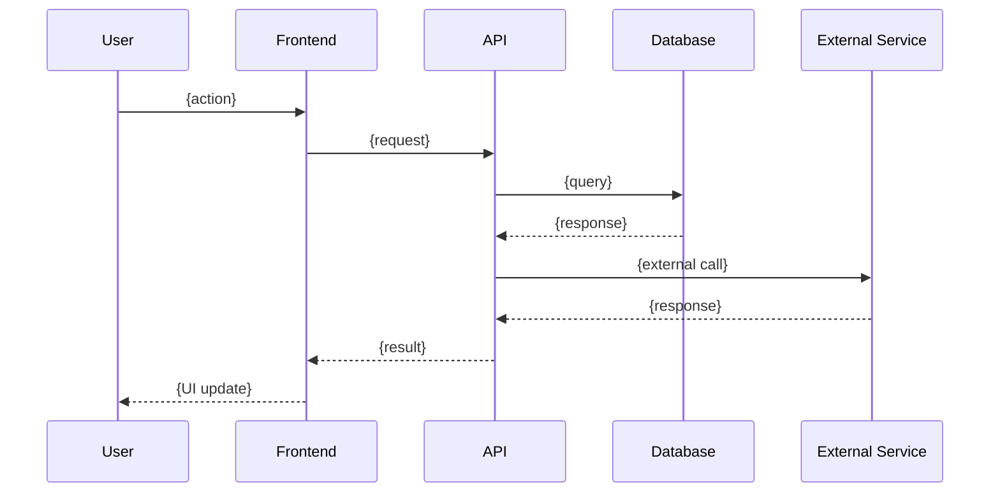

# /vault:sysanalyst — System Analyst Role

Generate technical specification for a task based on BA and Designer outputs. Adapts to project style via Project DNA.

## Workflow

1. Parse `$ARGUMENTS` for task ID. If empty, ask for one.
2. Call `get_project_dna` to understand the project's tech stack, API patterns, and architecture. Use the detected stack for ER diagrams, API contracts, and NFRs.
3. Call `get_task` to read task details and existing role outputs.
4. Call `get_role_output` for `BA` and `Designer` roles to get context.
4. If previous roles are missing, warn but continue with available context.
5. Generate SystemAnalyst output following the template below.
6. Call `write_role_output` with `role=SystemAnalyst` and the generated content.
7. Call `log_step` to record completion.
8. Output: `✓ System analysis complete for {task_id}. Next role: Developer.`

## Output Template

```markdown
# Technical Specification — {task_id}: {title}

## Overview

{1-2 sentence technical summary of what this task implements}

## C4 Component Diagram

> [!NOTE]- Component diagram showing affected subsystem
> ```mermaid
> C4Component
>     title Component Diagram — {affected subsystem}
>
>     Container_Boundary(api, "{Container}") {
>         Component(comp1, "{Component 1}", "{Tech}", "{Role}")
>         Component(comp2, "{Component 2}", "{Tech}", "{Role}")
>         Component_Ext(ext, "{External}", "{Tech}", "{Role}")
>     }
>
>     Rel(comp1, comp2, "{Relationship}")
>     Rel(comp2, ext, "{Relationship}")
> ```

## Data Model

```mermaid
erDiagram
    {ENTITY_A} ||--o{ {ENTITY_B} : "{relationship}"
    {ENTITY_A} {
        uuid id PK
        string name
        timestamp created_at
    }
    {ENTITY_B} {
        uuid id PK
        uuid entity_a_id FK
        string value
    }
```

### Migrations Required
- {Migration description}

## API Contracts

### `{METHOD} {/path}`

| Property | Value |
|----------|-------|
| **Auth** | {Required — Bearer JWT / API Key / None} |
| **Rate Limit** | {N requests/min} |
| **Pagination** | {cursor / offset / none} |

**Headers:**
```
Authorization: Bearer {token}
Content-Type: application/json
```

**Request:**
```json
{
  "field": "type — description"
}
```

**Response `200 OK`:**
```json
{
  "field": "type — description"
}
```

**Error Responses:**

| Code | Condition | Body |
|------|-----------|------|
| `400` | {Invalid input} | `{"error": "{message}"}` |
| `401` | {Unauthorized} | `{"error": "Unauthorized"}` |
| `404` | {Not found} | `{"error": "Not found"}` |
| `500` | {Server error} | `{"error": "Internal error"}` |

## Integration Points

| System | Type | Direction | Protocol | Notes |
|--------|------|-----------|----------|-------|
| {Service} | {Internal/External} | {In/Out/Both} | {REST/gRPC/Event} | {Details} |

## Sequence Diagram



## Non-Functional Requirements (NFRs)

| Category | Requirement | Target |
|----------|-------------|--------|
| ⚡ Performance | Response time | < {N}ms (p95) |
| 📈 Scalability | Concurrent users | {N} users |
| 🔒 Security | {Requirement} | {Standard} |
| 🟢 Availability | Uptime | {N}% |
| 💾 Data Retention | {Requirement} | {Duration} |

## Performance Considerations

- {Expected load, response time requirements}
- {Caching strategy}
- {Query optimization notes}

## Security Considerations

- {Auth/authz requirements}
- {Data validation}
- {Sensitive data handling}
```

## Rules

- Reference BA acceptance criteria when defining API contracts.
- Reference Designer components when describing data flow.
- Data models MUST use Mermaid `erDiagram` — not ASCII trees.
- API contracts MUST include error responses with status codes.
- Include NFR table — performance, scalability, security, availability targets.
- Be specific about data types — use "UUID", "ISO 8601 datetime", "enum(a,b,c)", not just "string".
- Flag breaking changes if modifying existing APIs.
